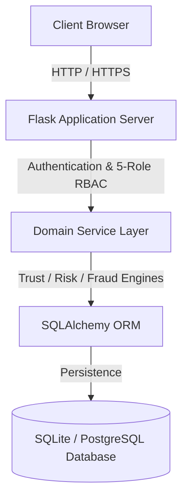

# 🛡️ Vendor Data Quality & Trust Issues

[](https://www.python.org/)
[](https://flask.palletsprojects.org/)
[](https://www.sqlite.org/)
[](https://www.postgresql.org/)
[](https://www.docker.com/)
[](http://localhost:5000/api/v2/docs)
[](LICENSE)

An enterprise-grade vendor governance, compliance auditing, risk scoring, and fraud detection platform.

---

> [!NOTE]
> This platform provides automated vendor data verification, multi-factor trust scoring, Isolation Forest anomaly detection, and audit trail logging for enterprise procurement systems.

---

## 📋 About

### What Problem This Project Solves
Organizations struggle with inconsistent vendor profile information, unverified tax identifiers, missing compliance documentation, and unmonitored risk factors across procurement workflows.

### Why Organizations Need It
Manual vendor auditing is slow and prone to oversight. Organizations need a unified platform that automatically validates vendor data, calculates multi-factor trust scores, flags duplicate GST/PAN registrations, tracks document expiry, and generates audit-ready reports.

### Who Will Use It
- **Procurement Managers**: Oversee vendor onboarding, directory records, and SLA compliance.
- **Risk & Compliance Officers**: Monitor vendor risk scores, document verifications, and compliance audits.
- **Fraud Investigators**: Analyze anomaly patterns, tax identifier mismatches, and flag suspicious entities.
- **Auditors & Leadership**: Review executive telemetry, audit trails, and system-wide compliance posture.

### What the Application Does
The application aggregates vendor data into a centralized database, calculates real-time trust and quality scores, scans uploaded documents, identifies duplicate tax identifiers and billing anomalies, tracks system-wide audit events, and provides 5-role access control with interactive dashboards.

---

## ✨ Features

### Vendor Management
- ✔ Full CRUD operations for enterprise vendor profiles
- ✔ Tax identifier validation (GSTIN and PAN formats)
- ✔ Categorization across 8 major business sectors
- ✔ GIS location mapping across major geographic regions

### Trust Engine
- ✔ Multi-factor trust score calculation (0.0 to 100.0 index)
- ✔ Dynamic trust tiering (High Trust, Medium Trust, Low Trust)
- ✔ Score recalculation based on compliance history and document status

### Risk Engine
- ✔ Isolation Forest anomaly detection for abnormal financial patterns
- ✔ Predictive alert generation for impending risk threshold breaches
- ✔ Categorized risk severity levels (Critical, High, Medium, Low)

### Fraud Detection
- ✔ Duplicate GSTIN and PAN cross-reference verification
- ✔ Blacklist entity screening and bank account hashing checks
- ✔ Investigation case management with evidence recording

### Compliance
- ✔ Document expiration monitoring and audit timeline logging
- ✔ Compliance status tracking (Approved, Pending Review, Non-Compliant)
- ✔ Automated compliance percentage aggregation

### OCR & Document Verification
- ✔ Binary magic byte validation (`%PDF-`) for uploaded vendor files
- ✔ SHA-256 document hashing to prevent duplicate uploads
- ✔ Document verification status tracking

### Executive Dashboard
- ✔ High-level KPI summary (total vendors, avg trust, compliance %, active fraud alerts)
- ✔ Interactive GIS geographic vendor map visualization
- ✔ Category distribution breakdowns and performance rankings

### Reports & Audit Trail
- ✔ Exportable audit reports in CSV and JSON formats
- ✔ Immutable audit trail recording user actions, IP addresses, and configuration changes
- ✔ Grounded AI assistant for contextual profile summary and document queries

---

## 📸 Screenshots

<!-- Executive Dashboard Screenshot -->
<!-- Vendor Directory 360 Screenshot -->
<!-- GIS Geographic Analytics Screenshot -->
<!-- XAI Anomaly Dashboard Screenshot -->
<!-- Audit Logs Viewer Screenshot -->

---

## 🏗️ Architecture



---

## 🛠️ Tech Stack

| Layer | Technologies Used |
|---|---|
| **Frontend** | HTML5, Vanilla JavaScript, Vanilla CSS, ApexCharts, Leaflet.js |
| **Backend** | Python 3.11+, Flask Framework, Gunicorn WSGI Server |
| **Database** | SQLite (Development/Demo), PostgreSQL (Production), SQLAlchemy ORM |
| **Authentication** | Session Auth, PBKDF2 Password Hashing (SHA-256), 5-Role RBAC |
| **AI & Machine Learning** | scikit-learn (Isolation Forest), TF-IDF Vector Search, RAG Grounding |
| **Deployment** | Docker, Docker Compose, WSGI / Gunicorn |
| **Testing** | pytest, Python unittest |

---

## 📂 Project Structure

```text
vendor_project/
├── app.py                      # Main Flask application entry point
├── config.py                   # System configuration & environment variables
├── requirements.txt            # Python dependencies
├── Dockerfile                  # Production container definition
├── docker-compose.yml          # Docker Compose orchestration
├── LICENSE                     # MIT License
├── src/
│   ├── domain/
│   │   ├── services/           # Business logic & enterprise data services
│   │   └── engines/            # Trust, risk, fraud, and predictive calculation engines
│   ├── infrastructure/
│   │   ├── database/           # SQLAlchemy ORM schemas and DB setup
│   │   └── security/           # RBAC decorators and security utilities
│   └── presentation/
│       └── api/                # REST API blueprints
├── templates/                  # Frontend HTML view templates
├── static/                     # CSS stylesheets, JS modules, OpenAPI spec
└── instance/                   # SQLite database storage directory
```

---

## 🚀 Installation

### Prerequisites
- Python 3.11 or higher
- pip (Python package installer)
- Git

### Local Setup
```bash
# 1. Clone the repository
git clone https://github.com/rahulpoona58-del/vendor-data.git
cd vendor-data

# 2. Create and activate a virtual environment
python -m venv venv

# On Windows:
venv\Scripts\activate
# On Linux/macOS:
source venv/bin/activate

# 3. Install required dependencies
pip install -r requirements.txt
```

---

## 🌐 Application

### Running Locally
```bash
python app.py
```

### Running with Docker
```bash
docker compose up --build
```

> [!TIP]
> Once the application starts, navigate to `http://localhost:5000/demo` to access the interactive All-In-One Command Portal.

### Application Endpoints
- **Master Command Portal**: `http://localhost:5000/demo`
- **Executive Dashboard**: `http://localhost:5000/executive-dashboard`
- **Interactive Swagger Docs**: `http://localhost:5000/api/v2/docs`
- **Health Check API**: `http://localhost:5000/api/v2/health`

---

## 🔐 Security & Demo Credentials

The demo environment includes pre-seeded user personas for testing 5-Role Access Control:

| Role Persona | Email | Password | Access Scope |
|---|---|---|---|
| **Admin** | `admin@demo.local` | `Admin123!` | System configuration, score overrides, audit log management |
| **Manager** | `manager@demo.local` | `Manager123!` | Vendor profile CRUD, report generation |
| **Auditor** | `auditor@demo.local` | `Auditor123!` | System audit inspection, compliance verification |
| **Analyst** | `analyst@demo.local` | `Analyst123!` | Anomaly analysis, fraud check viewing, read-only analytics |
| **Viewer** | `viewer@demo.local` | `Viewer123!` | Read-only directory viewing |

---

## 📄 API Documentation

### System & Health Endpoints
| Method | Endpoint | Description |
|---|---|---|
| `GET` | `/api/v2/health` | System health check probe |
| `GET` | `/api/v2/demo/status` | Demo environment status overview |
| `POST` | `/api/v2/demo/reset` | Resets demo database to baseline state |

### Authentication Endpoints
| Method | Endpoint | Description |
|---|---|---|
| `POST` | `/api/v2/auth/login` | Authenticates user and initiates session |
| `POST` | `/api/v2/auth/logout` | Terminates active user session |
| `GET` | `/api/v2/auth/me` | Returns active user profile and role |

### Vendor Operations Endpoints
| Method | Endpoint | Description |
|---|---|---|
| `GET` | `/api/v2/vendors` | Retrieves paginated vendor list |
| `POST` | `/api/v2/vendors` | Creates a new vendor record |
| `GET` | `/api/v2/vendors/<id>` | Retrieves specific vendor details |
| `PUT` | `/api/v2/vendors/<id>` | Updates vendor profile information |
| `DELETE` | `/api/v2/vendors/<id>` | Deletes a vendor record |

### Analytics & Audit Endpoints
| Method | Endpoint | Description |
|---|---|---|
| `GET` | `/api/v2/analytics/executive` | Returns executive KPIs and sector breakdowns |
| `GET` | `/api/v2/enterprise/telemetry` | Comprehensive system telemetry data |
| `GET` | `/api/v2/analytics/geographic` | GIS location coordinates for map rendering |
| `GET` | `/api/v2/predictive/alerts` | Predictive risk alerts and anomaly vectors |
| `GET` | `/api/v2/audit-logs` | System audit log entries with filter parameters |

---

## 🧪 Testing

Run the test suite using pytest or the included verification tools:

```bash
# Run unit and API test suite
python -m pytest

# Run automated QA dashboard matrix verification
python scratch/verify_all_dashboards_qa.py
```

---

## 📈 Future Scope

- Integration with official government GSTN and Income Tax portal verification APIs.
- Real-time Webhook notifications for critical fraud alerts and compliance failures.
- Multi-currency financial risk evaluation and exchange rate adjustments.
- Automated document OCR text parsing using cloud vision services.
- Attribute-Based Access Control (ABAC) for dynamic permission rules.
- Automated email alerts for impending document expiration dates.
- Single Sign-On (SSO) integration via OAuth2, OpenID Connect, and SAML 2.0.
- PostgreSQL migration scripts and automated migration pipelines (Alembic).

---

## 📜 License

Distributed under the MIT License. See [LICENSE](LICENSE) for details.