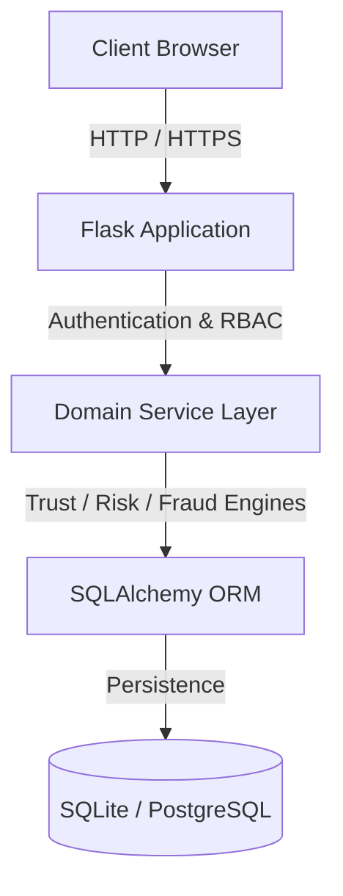

# Vendor Data Quality & Trust Issues


An enterprise vendor governance, compliance auditing, risk scoring, and fraud detection platform.

---

## About

### What Problem This Project Solves
Organizations struggle with inconsistent vendor profile information, unverified tax identifiers, missing compliance documentation, and unmonitored risk factors across procurement workflows.

### Why Organizations Need It
Manual vendor auditing is slow and prone to oversight. Organizations need a unified platform that automatically validates vendor data, calculates multi-factor trust scores, flags duplicate GST/PAN registrations, tracks document expiry, and generates audit-ready reports.

### Who Will Use It
- **Procurement Managers**: Oversee vendor onboarding, directory records, and SLA compliance.
- **Risk & Compliance Officers**: Monitor vendor risk scores, document verifications, and compliance audits.
- **Fraud Investigators**: Analyze anomaly patterns, tax identifier mismatches, and flag suspicious entities.
- **Auditors & Leadership**: Review executive telemetry, audit trails, and system-wide compliance posture.

### What the Application Does
The application aggregates vendor data into a centralized database, calculates real-time trust and quality scores, scans uploaded documents, identifies duplicate identifiers and billing anomalies, tracks system-wide audit events, and provides role-based access control with interactive dashboards.

---

## Features

### Vendor Management
- Full CRUD operations for vendor profiles.
- Tax identifier validation (GSTIN and PAN number formats).
- Categorization across IT, Logistics, Healthcare, Finance, Manufacturing, Telecom, and Consulting.
- Location mapping across major geographic regions.

### Trust Engine
- Multi-factor trust score calculation (0.0 to 100.0).
- Dynamic trust tiering (High Trust, Medium Trust, Low Trust).
- Automated score adjustment based on compliance history, SLA performance, and document status.

### Risk Engine
- Isolation Forest anomaly detection for abnormal financial and operational patterns.
- Predictive alert generation for impending risk threshold breaches.
- Categorized risk severity levels (Critical, High, Medium, Low).

### Fraud Detection
- Duplicate GSTIN and PAN cross-reference verification.
- Blacklist screening and bank account hashing checks.
- Flagged case management with evidence recording and investigation tracking.

### Compliance
- Document expiration monitoring and audit timeline logging.
- Compliance status tracking (Approved, Pending Review, Non-Compliant).
- Automated compliance percentage aggregation.

### OCR & Document Verification
- Binary magic byte validation (`%PDF-`) for uploaded vendor files.
- Automated document hash generation (SHA-256) to prevent duplicate uploads.
- Verification status tracking (Verified, Pending, Under Review).

### Executive Dashboard
- High-level KPI summary (total vendors, average trust score, compliance rate, active fraud alerts).
- Geographic vendor distribution visualization via interactive GIS maps.
- Category breakdown and top vendor performance rankings.

### Reports
- Exportable audit reports in CSV and JSON formats.
- Comprehensive telemetry data aggregation for compliance reporting.

### AI Assistant
- Grounded contextual copilot providing response synthesis for vendor profiles and audit records.

### Audit Trail
- System-wide immutable logging of configuration changes, score overrides, and user actions.
- Client IP address and module-level audit tracking.

### Authentication & Security
- 5-Role Role-Based Access Control (`Admin`, `Manager`, `Auditor`, `Analyst`, `Viewer`).
- Password hashing using PBKDF2 with SHA-256.
- Session authorization and token revocation checks.

---

## Screenshots

<!-- Executive Dashboard Screenshot -->
<!-- Vendor Directory 360 Screenshot -->
<!-- GIS Geographic Analytics Screenshot -->
<!-- XAI Anomaly Dashboard Screenshot -->
<!-- Audit Logs Viewer Screenshot -->

---

## System Architecture



---

## Technology Stack

| Layer | Technologies |
|---|---|
| **Frontend** | HTML5, Vanilla JavaScript, Vanilla CSS, ApexCharts, Leaflet.js |
| **Backend** | Python 3.11+, Flask Framework, Gunicorn |
| **Database** | SQLite (Development/Demo), PostgreSQL (Production), SQLAlchemy ORM |
| **Authentication** | Custom Session Auth, PBKDF2 Password Hashing, 5-Role RBAC |
| **AI / ML** | scikit-learn (Isolation Forest Anomaly Detection), TF-IDF Vector Search |
| **Deployment** | Docker, Docker Compose, WSGI / Gunicorn |
| **Testing** | pytest, Python unittest |

---

## Folder Structure

```text
vendor_project/
├── app.py                      # Main application entry point & Flask initialization
├── config.py                   # Platform configuration settings
├── requirements.txt            # Python dependencies
├── Dockerfile                  # Container build instructions
├── docker-compose.yml          # Container orchestration configuration
├── LICENSE                     # MIT License file
├── src/
│   ├── domain/
│   │   ├── services/           # Enterprise domain logic & data services
│   │   └── engines/            # Trust, risk, fraud, and predictive calculation engines
│   ├── infrastructure/
│   │   ├── database/           # SQLAlchemy ORM models & database setup
│   │   └── security/           # RBAC decorators & password utilities
│   └── presentation/
│       └── api/                # REST API blueprints (auth, vendors, analytics, audit)
├── templates/                  # HTML templates (demo portal, executive, dashboard)
├── static/                     # CSS stylesheets, JS scripts, and OpenAPI specification
└── instance/                   # SQLite database storage (vendor_trust.db)
```

---

## Installation

### Prerequisites
- Python 3.11 or higher
- pip (Python package installer)
- Git

### Local Setup
```bash
# 1. Clone the repository
git clone https://github.com/rahulpoona58-del/vendor-data.git
cd vendor-data

# 2. Create and activate a virtual environment
python -m venv venv
# On Windows:
venv\Scripts\activate
# On Linux/macOS:
source venv/bin/activate

# 3. Install dependencies
pip install -r requirements.txt
```

---

## Running

### Running Locally
```bash
python app.py
```

### Running with Docker
```bash
docker compose up --build
```

### Application URLs
- **Main Portal**: `http://localhost:5000/demo`
- **Executive Dashboard**: `http://localhost:5000/executive-dashboard`
- **OpenAPI / Swagger Specs**: `http://localhost:5000/api/v2/docs`
- **Health Check API**: `http://localhost:5000/api/v2/health`

---

## Demo Credentials

The demo environment includes pre-seeded user accounts for testing Role-Based Access Control:

| Role | Email | Password | Access Scope |
|---|---|---|---|
| **Admin** | `admin@demo.local` | `Admin123!` | Full system access, score overrides, audit log management |
| **Manager** | `manager@demo.local` | `Manager123!` | Vendor CRUD operations, report generation |
| **Auditor** | `auditor@demo.local` | `Auditor123!` | Audit trail inspection, compliance verification |
| **Analyst** | `analyst@demo.local` | `Analyst123!` | Risk analysis, fraud check viewing, read-only analytics |
| **Viewer** | `viewer@demo.local` | `Viewer123!` | Read-only directory access |

---

## API Documentation

### System & Health Endpoints
| Method | Endpoint | Description |
|---|---|---|
| `GET` | `/api/v2/health` | System health check probe |
| `GET` | `/api/v2/demo/status` | Demo environment status summary |
| `POST` | `/api/v2/demo/reset` | Resets demo database to baseline state |

### Authentication Endpoints
| Method | Endpoint | Description |
|---|---|---|
| `POST` | `/api/v2/auth/login` | Authenticates user and initiates session |
| `POST` | `/api/v2/auth/logout` | Terminates active user session |
| `GET` | `/api/v2/auth/me` | Returns current user profile and role |

### Vendor Management Endpoints
| Method | Endpoint | Description |
|---|---|---|
| `GET` | `/api/v2/vendors` | Retrieves paginated vendor records |
| `POST` | `/api/v2/vendors` | Creates a new vendor entry |
| `GET` | `/api/v2/vendors/<id>` | Retrieves specific vendor profile details |
| `PUT` | `/api/v2/vendors/<id>` | Updates an existing vendor profile |
| `DELETE` | `/api/v2/vendors/<id>` | Deletes a vendor record |

### Analytics & Telemetry Endpoints
| Method | Endpoint | Description |
|---|---|---|
| `GET` | `/api/v2/analytics/executive` | High-level executive KPIs and category breakdowns |
| `GET` | `/api/v2/enterprise/telemetry` | Comprehensive system telemetry data |
| `GET` | `/api/v2/analytics/geographic` | GIS geographic location coordinate data |

### Risk & Audit Endpoints
| Method | Endpoint | Description |
|---|---|---|
| `GET` | `/api/v2/predictive/alerts` | Active predictive risk alerts |
| `GET` | `/api/v2/audit-logs` | System audit log entries with filter parameters |
| `POST` | `/api/v2/documents/upload` | Validates and uploads vendor document files |

---

## Testing

Execute the test suite using pytest or the included scratch scripts:

```bash
# Run pytest test suite
python -m pytest

# Run full API and dashboard verification script
python scratch/verify_all_dashboards_qa.py
```

---

## Project Modules

- **Vendor Domain Module**: Manages core vendor entities, profile fields, GST/PAN validation, and ORM persistence.
- **Trust Calculation Engine**: Computes dynamic 0–100 trust scores using weighted compliance, SLA, and verification inputs.
- **Predictive Risk & Anomaly Engine**: Runs Isolation Forest algorithms to detect financial anomalies and generate risk alerts.
- **Fraud Detection Module**: Validates tax identifiers, detects duplicate registrations, and flags high-risk vendors.
- **Compliance & Audit Module**: Tracks document verifications, maintains timeline logs, and records system audit traces.
- **Security & Authorization Module**: Enforces 5-role RBAC, handles session authorization, and sanitizes input data.
- **Presentation & Dashboard Module**: Renders web views, interactive charts, GIS maps, and Swagger OpenAPI documentation.

---

## Future Scope

- Integration with external government tax verification APIs (GSTN / Income Tax portal).
- Real-time Webhook notifications for critical fraud alerts and compliance failures.
- Multi-currency financial risk evaluation and exchange rate adjustment.
- Support for automated document OCR parsing using cloud vision services.
- Enhanced role permissions with custom attribute-based access control (ABAC).
- Automated email alerts for upcoming document expiration dates.
- SSO (Single Sign-On) support via SAML 2.0 and OAuth2 / OpenID Connect.
- Production PostgreSQL migration and automated database migration pipelines (Alembic).

---

## License

Distributed under the MIT License. See [LICENSE](LICENSE) for details.